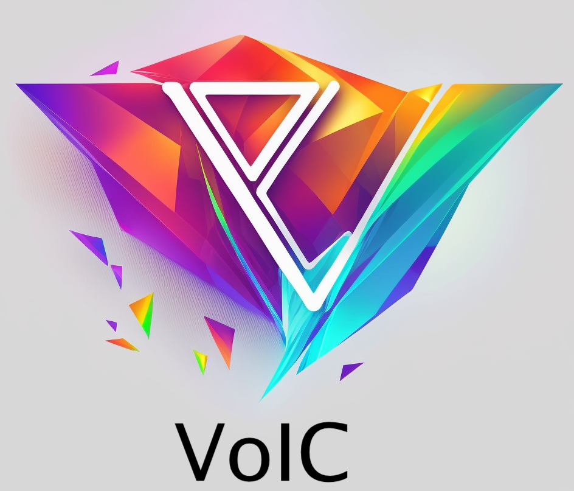

# VoIC



VoIC is a module and set of examples that can be used to build VoIC compliant DAOs that run on ICDev's VoIC site.

## The component - voic.mo:

Construtor:

```
public type Options = {
  axonCanister: Principal; // canister that holds the axon your are managing
  axonId : Nat; //ID of the managed axon
  voiceWallet: Principal; //wallet canister(proxy) of your axon
  icp_fee: ?Nat64; //fee for ICP transfers (defaults to 10000)
};
```

```
public func process(buffer: Buffer.Buffer<Types.BatchOp>) : async* Result.Result<Types.AxonCommandExecution, Types.AxonError>
```

Process a set of batch ops(burn and mints). This allows the canister that is set a minter on the DAO to update balances based on inputs.

```
public func icrc1_seed(owner: Principal, subaccounts: [[Nat8]]) : async* Result.Result<Types.AxonCommandExecution, Types.AxonError>
```

Seeds an ICRC1 account by scanning all provided subaccounts for a principal and setting the balance for that principal to the final total.

```
public func dip20_seed(owner: Principal, subaccounts: [[Nat8]]) : async* Result.Result<Types.AxonCommandExecution, Types.AxonError>
```

Seeds an DIP account to a particular balance. Dip20 accounts don't have sub accounts.


```
public func ogynft_seed(owner: Principal, balance: Nat) : async* Result.Result<Types.AxonCommandExecution, Types.AxonError>{
```

Seeds an origyn_nft account to a particular balance. While Origyn NFTs can support accounts, they typically do not and operate on principals.

```
public func mint(owner: Principal, amount: Nat) : async* Result.Result<Types.AxonCommandExecution, Types.AxonError>
```
Mints new tokens to a principal.

```
public func burn(owner: Principal, amount: Nat) : async* Result.Result<Types.AxonCommandExecution, Types.AxonError>
```

Burns tokens from a principal.

```
public func transfer(from_owner: Principal, to_owner:Principal, amount: Nat) : async* Result.Result<Types.AxonCommandExecution, Types.AxonError>
```

Moves tokens from one account to another via mint and burn. Useful when scanning transaction logs.

```
public func get_delegation_info(caller: ?Principal, follower: ICRCTypes.Account, canister: Principal, fee: Nat) : Types.DelegationInfo

public type DelegationInfo = {
        delegationAccount :  ?{ 
          follower : Principal;
          followee : Principal;
          account : ICRCTypes.Account;
          address_legacy_blob : Blob;
          address_legacy_text : Text;
          address_text: Text;

        };
        removalAccount : {
          follower: Principal;
          account: ICRCTypes.Account;
          address_legacy_blob : Blob;
          address_legacy_text : Text;
          address_text: Text;
        };
        fee : Nat;
      };
```

Returns the account info that a user can send ICP to create a delegation from one Principal to another.

```
public func process_delegation(caller: ?Principal, follower: ICRCTypes.Account, block: Nat64, canister: Principal, fee: Nat): async* Result.Result<Bool, Text>
```

Process the delegation payment and moves the fee to the ICDevs account. This account will pay for gas for the services and donate excess to the ICDevs general Treasury that is used for developing software on the IC.

## The examples

### examples/icrc


